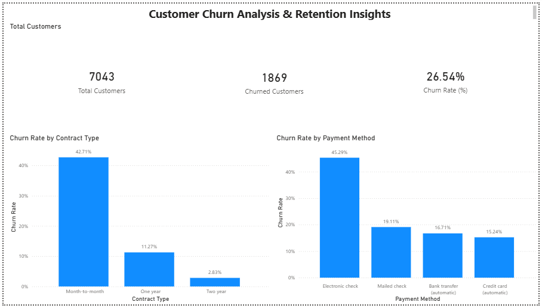

Customer Churn Analysis & Retention Insights

 Overview
- Analyzed customer churn behavior using SQL and Power BI to identify key drivers of churn and recommend retention strategies.

 Tools Used
- SQL (PostgreSQL)
- Power BI
- Excel

 Dataset
- Telco Customer Churn Dataset (~7,000 records)

 Key Insights
- Customers with low tenure were ~2.8× more likely to churn
- Month-to-month users had a 42.7% churn rate (~15× higher than long-term contracts)
- Electronic check users showed ~3× higher churn than automatic payment methods

 Dashboard

 Business Impact
- Early engagement strategies can reduce churn
- Promoting long-term contracts improves retention
- Payment experience impacts customer loyalty